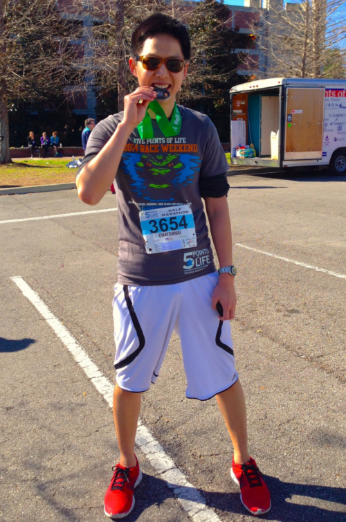

<!-- because of the auto-margin element in css for wrapper, this page shifts a bit compare to others  -->
# Hi there, you are on _About me_ page!

## My brief journey :)
<!--  -->
My name is Chatdanai Lumdee, or 'Tua'. I am a native Thai grew up in Phitsanulok, a city 400 km to the north of Bangkok. During high school, my sister gave me a book, [The Next Big Thing Is Really Small](https://www.amazon.com/Next-Thing-Really-Small-Nanotechnology/dp/1400046890), which initiated my interest nanoscience. This serves as a reference point leading to my career in the field where I later developed a specialty in nanophotonics.

Currently, I am a postdoctoral researcher in Sweden.

## Interests
I am very enthusiastic in applying my skills and experiences toward creating knowledge-based society driven by research as well as developing and commercialization of advanced photonics-related technologies such as data storage, energy harvesting, photocatalysis, and biomedical devices.

As a learning fanatic by nature, I am motivated to develop capabilities in areas besides hard-sciences. One example is learning to apply my coding and analytical background toward big-data analysis. I am also interested in entrepreneurship where technical expertise can be used to solve problems in everyday life.

## Hobbies
There are several things I like to do in my free time. For sport and exercise, I go to gym for fitness training, badminton, climbing, hiking, and sometimes running. I also like to read where the categories range from philosophy, entrepreneurship, science, and manga. Watching videos on YouTube is also fun and educational. On top of that, I enjoy learning new software and coding e.g. making this webpage.

## Research career
It started when I graduated from the Faculty of Engineering, [Chulalongkorn University](http://www.chula.ac.th/en/) in Thailand with a major in nano engineering. I then took a fellowship from [CREOL/The College of Optics and Photonics](http://www.creol.ucf.edu/) in Orlando, FL to join a PhD program at one of the world’s foremost institutions for research and education in optics and photonics. At CREOL, I worked under the supervision of [Prof. Pieter G. Kik](http://kik.creol.ucf.edu/) where my research focused on optical phenomena at the nanoscale. Upon completion of the degree, I decided to continue my postdoctoral training in another continent and joined a group led by [Prof. Alexandre Dmitriev](https://scholar.google.com/citations?user=uFM2fgcAAAAJ) at [the University of Gothenburg](http://www.gu.se/english)/[Chalmers](http://www.chalmers.se/en/Pages/default.aspx) in Sweden. I am currently working on a highly collaborative EU funded project with the aim to develop a technological platform for the next generation of data storage units through nano-optics and nanomagnetism.

    <a href="C Lumdee, CV.pdf">About me in a formal format :)</a> 
    <a href="https://www.linkedin.com/in/chatdanai-lumdee">LinkedIn</a> 
    <a href="https://scholar.google.se/citations?user=TmGkgT4AAAAJ&hl=en">Google Scholar</a> 
    <a href="Thesis_Nanoscale Control of Gap-plasmon Enhanced Optical Processes.pdf">PhD thesis</a> 

